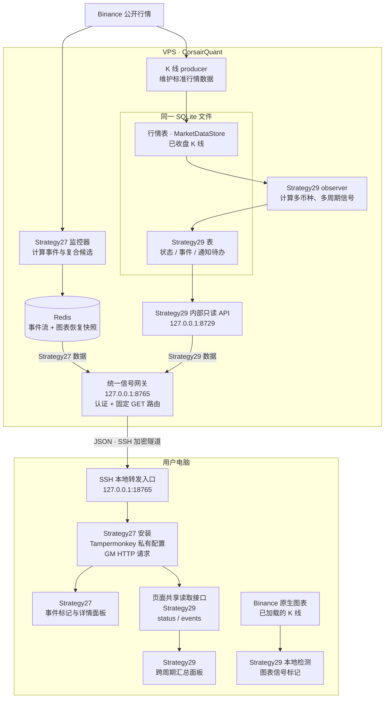
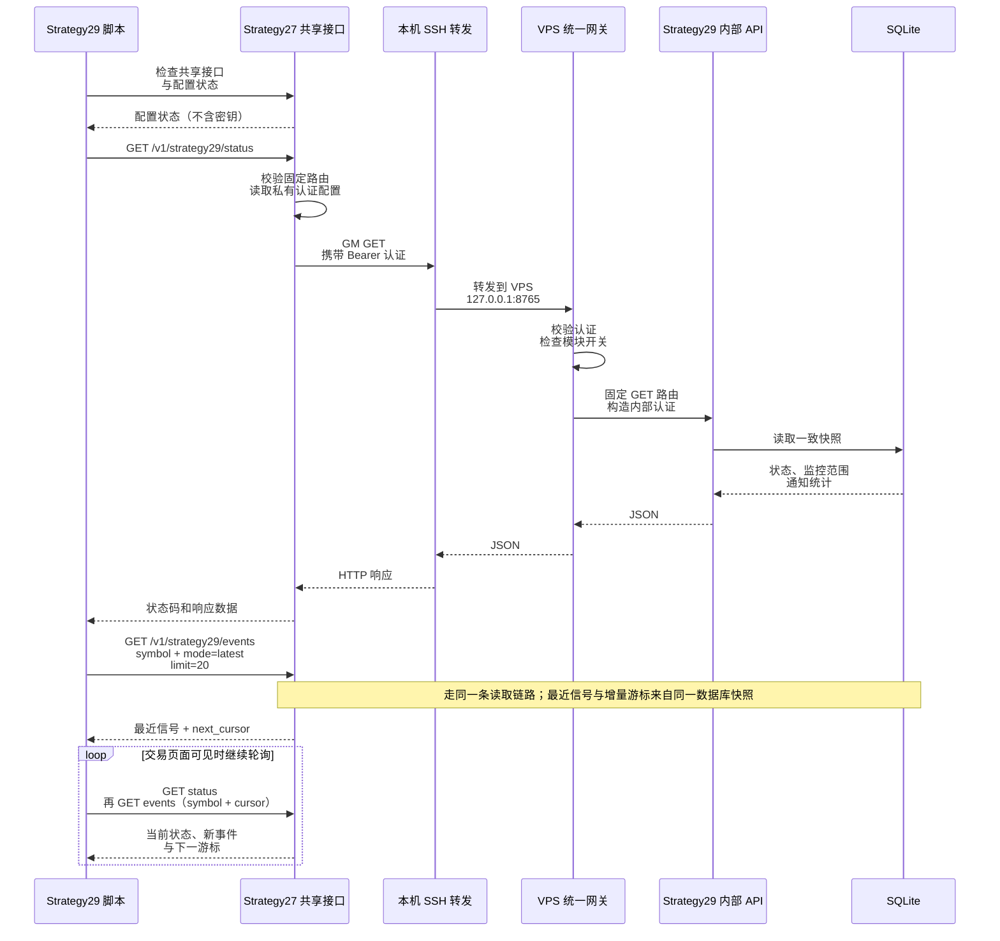

# CorsairQuant 信号网关：用途、架构与使用

Gateway（网关）是 **CorsairQuant 服务端的只读 HTTP 数据入口**。它把服务端已经计算好的策略事件、监控状态和最近信号提供给油猴脚本，再由脚本画到 Binance 页面上。

用户电脑通过 SSH 本地转发访问这个入口。Strategy27 脚本保存一份网关地址和认证配置，Strategy29 复用这条连接，并管理自己的汇总面板。网关不负责下单，也不需要 Binance API Key。

本文说明当前源码的组件关系和使用方式。图中的服务存在于代码中，不代表某台 VPS 已启动它们；服务端启用状态、浏览器安装状态和实时连通性需要分别确认。

## 哪些脚本使用它

| 脚本 | 与这个 gateway 的关系 | 页面上看到什么 |
| --- | --- | --- |
| [Strategy27 / CorsairQuant 信号客户端](../scripts/binance-strategy27-events.user.js) | 保存共享连接配置；直接读取 Strategy27 数据；为 Strategy29 提供受限的共享读取接口 | 匹配币种的 `1S` 图表上的事件、复合候选标记和详情面板 |
| [Strategy29 布林带信号](../scripts/binance-strategy29-bollinger.user.js) | 通过 Strategy27 提供的共享接口读取远端汇总；本地图表检测独立运行 | 当前币种的服务端跨周期状态、最近信号，以及单独根据本地已加载 K 线计算的图表标记 |
| 订单簿下单、合约交易数据、CoinMarketCap 数据等其他脚本 | 不经过这个 CorsairQuant 信号网关；各自使用页面能力或自己的数据接口 | 各自的交易辅助、行情或估值功能 |

这里有两个不同的功能：Strategy29 的**本地标记**读取当前图表已加载的 K 线；它的**远端汇总**读取服务器监控的周期。把图表切到 `1m`，不会让远端汇总只剩 `1m`；服务器正在监控的其他周期仍可显示。

## 整体架构

下图的箭头表示**数据流向**。HTTP 请求由浏览器主动发起，数据沿图示方向返回；服务端不会主动连接用户电脑。



这条链路中各层的职责是：

- **监控器负责计算。** Strategy27 在服务器处理行情并产生事件；Strategy29 从 producer 管理的 K 线数据中计算信号。浏览器远端客户端读取计算结果。
- **存储负责保留结果。** Strategy27 的 Redis 保存事件流和有界的图表恢复快照。K 线行情表和 Strategy29 的监控进度、持久事件、通知待办表位于同一个 SQLite 文件中，分别由行情存储和 observer 管理。
- **网关负责认证和读取。** Strategy27 路由读取 Redis；Strategy29 路由固定转发给内部 API，由内部 API 读取自己的数据库。浏览器无须直接连接 Redis 或 SQLite。
- **SSH 负责把入口带到本机。** 本机的 `127.0.0.1:18765` 转发到 VPS 的 `127.0.0.1:8765`。两处 `127.0.0.1` 分别指用户电脑和 VPS。
- **油猴脚本负责展示。** Strategy27 画自己的标记，Strategy29 管理自己的汇总面板；本地 Strategy29 图表检测还有一条独立的数据路径。

### 三个端口为什么不同

| 地址 | 所在位置 | 用途 | 用户需要填在哪里 |
| --- | --- | --- | --- |
| `http://127.0.0.1:18765` | 用户电脑 | SSH 本地转发入口；脚本实际请求的地址 | CorsairQuant 油猴菜单中的网关地址 |
| `127.0.0.1:8765` | VPS | 统一信号网关，接收 Strategy27 和 Strategy29 的读取请求 | SSH 转发的远端目标 |
| `http://127.0.0.1:8729` | VPS | Strategy29 专用内部只读 API | 由统一网关固定访问，浏览器无须单独配置 |

`18765` 是脚本默认本地端口，`8765` 是现有部署约定的网关端口；两者可以按部署配置调整，但 SSH 转发和油猴菜单必须对应。`8729` 是统一网关代码中的固定 Strategy29 后端地址。

## 两个脚本怎样共用一个连接

Strategy27 安装中的 Tampermonkey 私有存储保留 `strategy27GatewayOrigin` 和 `strategy27GatewayAuthSecret`。名字含有 `strategy27` 是因为沿用这个安装的配置；Strategy29 不需要再输入一份。

“共用连接”指共用网关入口和认证配置。各策略仍独立发起请求、管理游标与展示状态；SSH 转发由浏览器之外的独立进程维持。

Strategy29 通过页面上的 `Symbol.for('jh-userscripts.signal-gateway')` 调用共享接口。这个接口只接受规定的 Strategy29 查询，并返回观察数据和连接状态。认证由 Strategy27 安装内部完成，密钥不会交给 Strategy29 或页面代码。

以打开 BTCUSDT 页面、读取 Strategy29 最近信号为例：



页面共享接口允许页面代码读取这些规定的观察数据，因此它是**受限的数据读取能力**。它不提供任意 URL 代理，也不允许调用者设置认证头或发送写请求。Strategy29 共享读取最多同时进行四个请求，每个请求有十秒期限，并拒绝重定向、限制响应文本长度；这些限制属于共享接口，Strategy27 自己的长轮询使用独立请求适配器。

## 网关提供哪些数据

下面均为 `GET` 接口。路径相对于油猴菜单中设置的本机网关地址。

| 接口 | 谁使用 | 作用 |
| --- | --- | --- |
| `/v1/strategy27/events/bootstrap` | Strategy27 | 先取有界的事件展示快照和对应游标，恢复图表历史 |
| `/v1/strategy27/events` | Strategy27 | 按游标长轮询普通事件增量 |
| `/v1/strategy27/compound-candidates/bootstrap` | Strategy27 | 恢复复合候选展示快照和对应游标 |
| `/v1/strategy27/compound-candidates` | Strategy27 | 用独立游标长轮询复合候选增量 |
| `/v1/strategy29/status` | Strategy29，经共享接口 | 读取服务端监控范围、各周期处理状态、新鲜度和全局通知统计 |
| `/v1/strategy29/events` | Strategy29，经共享接口 | 首次按当前币种取最近信号，再按游标读取增量 |

**快照**相当于“先给我现在该显示的内容”，**游标**相当于“我读到哪里了”。这样刷新页面后可以先恢复内容，再接着收新数据，无须每次从最旧历史开始读取。

- Strategy27 的普通事件和复合候选各有独立快照、独立游标；先 bootstrap，再长轮询。有界快照最多保留各 80 条、两小时内的展示记录。
- Strategy29 首次查询使用 `symbol`、`mode=latest`、`limit=20`；随后使用 `symbol` 和 `cursor`。标准币种名如 `BTC/USDT:USDT`，由客户端编码成 URL 参数。一次轮询先读状态，再最多读取两页事件。
- 某次增量可能没有当前币种的新信号，但游标仍前进，因为它表示服务端全局事件的读取位置。
- 游标过期时按各自协议重新取快照。Strategy29 会清除远端信号行后重新同步；Strategy27 的同一图表上下文可以保留已验证的展示历史。
- Strategy29 远端结果显示在汇总面板中，不直接变成图表标记。其本地标记来自当前图表的独立检测。

## 怎样使用

### 1. 准备服务端与 SSH 转发

服务端需要运行统一网关，以及要读取的策略数据源。Strategy29 还需要自己的内部 API。服务实现与启用配置属于 [CorsairQuant](https://github.com/jackhai9/CorsairQuant)，本仓库发布浏览器客户端。

已有 SSH 转发服务时沿用它。手动建立转发的示例为：

```bash
ssh -N -T -o ExitOnForwardFailure=yes \
  -L 127.0.0.1:18765:127.0.0.1:8765 your-vps-alias
```

将 `your-vps-alias` 替换为自己已配置的 VPS SSH 别名，并保持该连接运行。这个命令只建立隧道，不会替你启动网关或策略监控器。SSH 身份认证与网关的 Bearer 认证是两个独立层次。

### 2. 安装脚本并设置一次网关

通过 [README 安装入口](../README.zh-CN.md#安装入口)安装或更新脚本：

1. 安装 **Strategy27 / CorsairQuant 信号客户端**，提供共享连接。
2. 需要 Strategy29 本地标记或跨周期汇总时，再安装 **Strategy29 布林带信号**。
3. 安装后打开或刷新 Binance 合约交易页，在 Tampermonkey 的 **【自写】Binance Strategy 27 事件标注** 下找到菜单，选择 **设置 CorsairQuant 本机网关地址**（`Set CorsairQuant local gateway URL`），填写 `http://127.0.0.1:18765`。
4. 使用 **设置 CorsairQuant 网关密钥**（`Set CorsairQuant gateway secret`），在本机提示框中输入与服务器对应的安装密钥。它保存在该脚本的私有存储中，不应放进源码、URL 或文档。
5. 更新后重新加载 Binance 合约页面。

地址必须是带端口的 `http://127.0.0.1:<port>`，不带 API 路径、查询参数或认证信息。当前客户端不接受 `localhost`、公网域名或 HTTPS 地址作为这个入口。

### 3. 在页面上查看结果

| 想看什么 | 页面条件 |
| --- | --- |
| Strategy27 事件与复合候选标记 | Binance 路由与图表币种匹配，并切到 `1S` 图表 |
| Strategy29 远端跨周期汇总 | 安装两份脚本、配置共享网关，打开目标合约交易页；无需切到 `1S` |
| Strategy29 本地图表标记 | 安装 Strategy29，打开支持的图表周期并加载足够 K 线；网关不可用不影响这条本地检测路径 |

Strategy29 汇总在共享接口可用时自动启动，没有单独的“启用远端汇总”菜单。没有共享接口时会提示更新或重新加载，本地图表检测仍可继续。页面隐藏时远端汇总暂停请求，恢复可见后继续；切换币种会建立对应的新查询上下文。

## 常见状态怎么理解

| 状态或现象 | 含义 | 检查位置 |
| --- | --- | --- |
| 等待共享接口 / 提示更新、重新加载 | Strategy29 找不到当前版本的共享接口 | Strategy27 是否安装、启用，更新后是否重新加载 |
| `configuration_required` | 共享连接尚未配置网关密钥 | Tampermonkey 的 CorsairQuant 配置菜单 |
| `unauthorized` / HTTP 401 | 网关未接受认证 | 在本机核对客户端与服务端的安装配置 |
| `module_disabled` | 统一网关刻意关闭了 Strategy29 转发模块 | 服务端模块开关 |
| `gateway_unavailable` | Strategy29 固定后端不可用，或返回了网关无法接受的响应 | VPS 内部 API 及其与统一网关的连接 |
| `database_unavailable` | Strategy29 内部 API 报告数据库不可用 | Strategy29 的数据库读取服务 |
| `redis_unavailable` | Strategy27 路由无法读取 Redis | Strategy27 的 Redis 数据链路 |
| 无法连接本机入口 / 请求超时 | 请求传输失败；仅凭此现象无法确定故障层 | 本机转发、SSH 连接和远端监听状态 |
| 已连接，但当前币种没有信号 | 可能未被服务器选中、仍在预热，或尚无满足条件的事件 | 面板的监控范围、处理状态、时间和当前图表条件 |

保留着历史行或旧标记不等于正在实时更新。判断数据是否新鲜时，需要一起看连接状态、服务端处理时间和信号时间。

服务端的 **monitor 启动列表、Strategy29 内部 API、统一网关的 Strategy29 模块、通知发送** 分别控制不同事情。安装脚本、建立隧道或成功读取状态，都不会自动启用其他开关；通知投递也有独立生命周期。

## 实现位置与进一步阅读

| 需要修改或核对的部分 | 事实来源 |
| --- | --- |
| 共享地址、私有配置键 | [signal-client-settings.js](../src/shared/signal-client-settings.js) |
| 页面共享接口、路由白名单、认证请求边界 | [signal-gateway-bridge.js](../src/shared/signal-gateway-bridge.js) |
| Strategy27 安装与配置菜单 | [Strategy27 entry](../src/binance-strategy27-events/index.user.js) |
| Strategy27 快照与长轮询 | [live-event-client.js](../src/binance-strategy27-events/core/live-event-client.js)、[compound-candidate-client.js](../src/binance-strategy27-events/core/compound-candidate-client.js) |
| Strategy29 共享接口适配 | [shared-gateway-client.js](../src/binance-strategy29-bollinger/core/shared-gateway-client.js) |
| Strategy29 面板生命周期、快照和增量查询 | [remote-summary.js](../src/binance-strategy29-bollinger/remote-summary.js)、[remote-summary-client.js](../src/binance-strategy29-bollinger/core/remote-summary-client.js) |
| 服务端统一入口 | [CorsairQuant: strategy27_live_gateway.py](https://github.com/jackhai9/CorsairQuant/blob/main/services/strategy27_live_gateway.py) |
| Strategy29 内部 API | [CorsairQuant: strategy29_observer_gateway.py](https://github.com/jackhai9/CorsairQuant/blob/main/services/strategy29_observer_gateway.py) |
| Strategy27 的 Redis 事件流与恢复快照 | [CorsairQuant: strategy27_display_snapshot.py](https://github.com/jackhai9/CorsairQuant/blob/main/utils/strategy27_display_snapshot.py) |
| Strategy29 计算、行情与状态共用 SQLite 的约束 | [CorsairQuant: monitor29_bollinger_ma60.py](https://github.com/jackhai9/CorsairQuant/blob/main/monitor/monitor29_bollinger_ma60.py) |
| Strategy29 快照、持久事件和只读查询 | [CorsairQuant: strategy29_observer_store.py](https://github.com/jackhai9/CorsairQuant/blob/main/utils/strategy29_observer_store.py) |
| 服务端与浏览器的职责决策 | [CorsairQuant ADR 035](https://github.com/jackhai9/CorsairQuant/blob/main/docs/architecture/035_strategy_owned_signal_panels.md) |

更详细的渲染、恢复和验证契约见 [Strategy27 开发手册](binance-strategy27-events-development.md)、[Strategy29 开发手册](binance-strategy29-bollinger-development.md)及[跨脚本验证手册](userscript-validation.md)。
